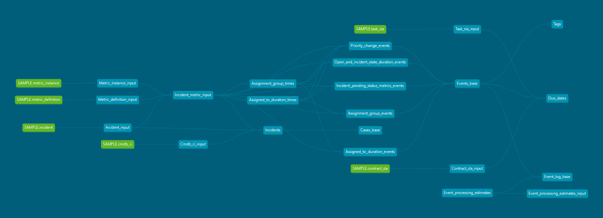

# TemplateOne-IM-ServiceNow-Connector

## Table of contents
- [General solution description](#General-solution-description)
    - [Source system](#Source-system)
    - [Process](#Process)
    - [Connector output & compatibility](#Connector-output-&-compatibility)
- [Prerequisites](#Prerequisites)
    - [Environmental settings](#Environmental-settings)
    - [System specific settings](#System-specific-settings)
- [Extraction](#Extraction)
    - [Load from Source Data extraction & connection to source system](#Load-from-Source-Data-extraction-&-connection-to-source-system)
    - [Load from File Data Import](#Load-from-File-Data-Import) 
    - [Input data](#Input-data)
- [Connector configuration](#Connector-configuration)
- [Connector design](#Connector-design)
    - [Entities](#Entities)
    - [Activities](#Activities)
    - [Output attribute mapping](#Output-attribute-mapping)
    - [Business data configuration](#Business-data-configuration)
    - [KPIs](#KPIs)
- [Connector design diagrams](#Connector-design-diagrams)
    - [Connector design flowchart](#Connector-design-flowchart)
    - [Entity relationship diagram](#Entity-relationship-diagram)
- [Connector design details](#Connector-design-details)
- [How to extend the connector](#How-to-extend-the-connector)
    - [Adding output attributes](#Adding-output-attributes)
    - [Adding activities](#Adding-activities)
    - [Adding entities](#Adding-entities)
    - [Adding business data](#Adding_business_data)
- [Limitations, known issues, common problems](#Limitations-known-issues-common-problems)
    - [Limitations](#Limitations)
    - [Known issues](#Known-issues)
    - [Common problems](#Common-problems)

## General solution description

UiPath connector directly feeds TemplateOne application with the historical data coming from digital workflows.
To improve its performance, native programing language is used.
ServiceNow tables do not have a similar structure to what entities are for the TemplateOne, therefore it is required to restructure, split and recreate ServiceNow tables.
The connector deals with data related to incident tracking (from the moment the incident is reported until its solution).


### Source system

This connector was created for ServiceNow systems and is intended to be compatible with any existing versions up to the version "Rome". For future releases the following conditions must be fulfilled:
* All tables and fields documented in the *Table Replication* section in the [Load from Source Extraction](../extractors/load-from-source/instructions.md)  must exist.
* The version must have the display value option.
* If using the load from source method CDATA must have compatibility with the version used.

### Process

The data tracks information about opening new incidents, assigning them to correct teams and users, working on, resolving and closing incidents.
In some cases, some time can be spent on pending status (usually related to a requisition for further information needed to resolve an incident). 
Also, reassignments for the different users and teams may occur during the process depending if the first assignment was correct, if the user assigned is actually the best option for resolving any specific incident or if the incident needs attention from multiple users and/or teams during its resolution.


### Connector output & compatibility
The connector is built for use with TemplateOne, and has the possibility to expand case and event attributes as required. 

## Prerequisites

The connector will track incidents' status history, therefore the minimal setup is having the following objects:
* incident
* metric_definition
* metric_instance

Additional events are included by tracking priority changes, assignment changes and pending status. However it is possible to add activities by tracking the Mi_definition from the supporting table "Incident_metric_input". 

### Environmental settings
In order to connect via CData, the user must have appropriate read permissions on each of the objects which are being extracted. All fields included in the input tables must be visible for the user extracting the data. In case any fields are not visible, permissions should be granted to the user, or create a user with the appropriate permissions.

### System specific settings

The ServiceNow Incident Management connector works on the process starting from the opening of an incident until its resolution and closure.
The following objects are necessary in order to obtain the main functionalities.

* incident
* metric_definition
* metric_instance

In order to obtain the due dates, it also necessary to have access to the following objects.

* task_sla
* contract_sla

In order to obtain the Configuration Item name from the Configuration Management Database it is also necessary to have access to the following object.

* cmdb_ci

## Extraction

###  Load from Source Data extraction & connection to source system

Detailed instructions for extractions can be found in the following document: [Load from Source Extraction](../extractors/load-from-source/instructions.md)

###  Load from File Data Import

Detailed instructions for extractions can be found in the following document: [Load from File Extraction](../extractors/load-from-file/instructions.md)

### Input data

The input data required for this connector are located in six tables from SeviceNow. The tables and fields required are:

**cmdb_ci**

Table that contains base configuration item information.

|Field                            |Stores
|:------------------------------- |:------------
|name_display_value               |Name of the CI instance.
|sys_class_name_display_value     |Category for CI.

**incident**

Table that contains data related to each incident number. A filter is applied on incident_input to get only the last record (Last_line = 1) for each incident number. This filter is necessary because some incident numbers may have multiple entries on this table.

|Field                            |Stores
|:------------------------------- |:--------------------------------------------------------------------------
|number                           |Incident number (Case id).
|assigned_to_display_value        |User assigned.
|priority_display_value           |Level priority for the incident.
|caller_id_display_value          |User that created the incident.
|assignment_group_display_value   |First team assigned to the incident.
|cmdb_ci_display_value            |Affected configuration item.
|close_code_display_value         |Category for the close status.
|state_display_value              |Status of the ticket.
|contact_type_display_value       |Type of contact used to report the incident.
|category_display_value           |Incident category (Security, Software, Server, Hardware, Network, etc).
|upon_approval_display_value      |Instructions for next steps in case of approval.
|upon_reject_display_value        |Instructions for next steps in case of rejection.
|urgency_display_value            |Urgency level for the Incident.
|sys_updated_on                   |Date the data was updated on the system.
|sys_id                           |ID necessary to join the Metric_instance table. This ID is a primary key for the table, therefore each record is unique for the table.

**task_sla**

Data related SLA and due dates.

|Field                       |Stores
|:-------------------------- |:--------------------------
|task_display_value          |Incident number (Case id).
|sla_display_value           |SLA Name.
|planned_end_time            |Expected date for the due date.

**contract_sla**

Contains data related to the duration for each SLA type. This table is needed in conjunction with task_sla table to obtain the last SLA record (due date type) assigned to case ids.

|Field                |Stores
|:------------------- |:---------
|name_display_value   |SLA Name.
|duration             |Max duration of an SLA type.

**metric_definition**

Defined metrics can track how long an audited field holds a certain value.

|Field            |Stores
|:--------------- |:------------
|sys_id           |Id necessary to join the metric_instance table. This ID is a primary key for the table, therefore each record is unique for the table.
|name             |Definition for the type of data retrieved on "value" field in metric_instance table.

**metric_instance**

A metric instance is a record in the metric_instance table.

|Field            |Stores
|:--------------- |:------------
|definition       |Id necessary to join the Metric_definition table. 
|id               |Id necessary to join the Incident table.
|sys_created_on   |Used for creating the Event end.
|value            |Contains data about status, users and teams.

### Connector configuration

The connector includes a series of variables that must be configured based on the ServiceNow configuration for the end customer. These variables are defined in the `dbt_project.yml` file.

|Variable               |Type            |Description                                                                                                                                                   |
|:----------------------|:---------------|:---------------------                                                                                                                                        |
|schema_sources         |string          |The schema where the raw data is stored|
|datetime_format        |string / Integer|Specifies the date format which will be used when converting to `DateTime` type. SQL Server format value is `20`. Snowflake format is `'YYYY-MM-DD hh24:mi:ss.ff3 TZHTZM'`.|
|max_datetime           |string          |Defines a maximum date that is used in the logic to recover the user and team for several tables and needs to match the *datetime_format* format|

Note: For Snowflake it has the timezone included due to when loading directly from ServiceNow it generates the datetime fields with timezone. 
For Snowflake:
If loading csv files that don't have time zone replace `'YYYY-MM-DD hh24:mi:ss.ff3 TZHTZM'` for `'YYYY-MM-DD hh24:mi:ss.ff3'` and also *max_datetime* needs to have the same format of *datetime_format*. For `'YYYY-MM-DD hh24:mi:ss.ff3 TZHTZM'` use `'9999-12-31 00:00:00.0 +0000'` and for `'YYYY-MM-DD hh24:mi:ss.ff3'` use `'9999-12-31 00:00:00.0'`.
For SQL Server: load from file datetime fields needs to be in the following format: 20 (yyyy-mm-dd hh:mm:ss).
If loading from souce *datetime_format* should be always `'YYYY-MM-DD hh24:mi:ss.ff3 TZHTZM'` and *max_datetime* equal to `'9999-12-31 00:00:00.0 +0000'` for Snowflake. For SQL Server
*date_timeformat* should be `20` and *max_datetime* should be `'9999-12-31 00:00:00.0'`.

## Connector design

### Entities

ServiceNow has only "Incidents" available as an Entity to be treated. The Incident is joined to the master data "cmdb_ci" in order to obtain complementary information about the configuration item.

|Entity       |Input data
|:------------|:------------------------------------------
|Incidents    |Incident, Configuration Item, User, Urgency

### Activities

All the activities are created based on data from the supporting table Incident_metric_input. 
Most of the activities are based on the "Mi_value" and "Mi_definition" fields (from Incident_metric_input), with the just exceptions being set using only the "Mi_definition" field. The exceptions are 'Open', 'First Assignment Group' and 'Assignment Group Change'.
The list of activities is:

|Activity												|Activity Created on                     |Mi_definition                     |Description
|:------------------------------------------------------|:---------------------------------------|:---------------------------------|:-----------------------------------------
|Open Incident											|Open_and_incident_state_duration_events |Open                              |Creation of an Incident number.
|Change status to "Assigned"							|Open_and_incident_state_duration_events |Incident State Duration           |Status for the Incident.
|To be Assigned											|Assigned_to_duration_events             |Assigned to Duration              |Assigning *NULL* to the user field.
|Assign User											|Assigned_to_duration_events             |Assigned to Duration              |Assigning a user to the incident.
|Assign First Assignment Group							|Assignment_group_events                 |Assignment Group                  |First time an assignment group is set to work on an Incident.
|Change Assignment Group								|Assignment_group_events                 |Assignment Group                  |Any subsequent group assignation.
|Change status to "Work in Progress"					|Open_and_incident_state_duration_events |Incident State Duration           |Status for the Incident.
|Change status to "Resolved"							|Open_and_incident_state_duration_events |Incident State Duration           |Status for the Incident.
|Close Incident											|Open_and_incident_state_duration_events |Incident State Duration           |Status for the Incident.
|Change Priority to # (1 to 4)							|Priority_change_events                  |Priority Change                   |Changes the level of priority for the Incident.
|Change status to "Pending"								|Open_and_incident_state_duration_events |Incident State Duration           |Status for the Incident.
|Add Pending reason "Awaiting Scheduled Appointment"	|Incident_pending_status_metrics_events  |Incident Pending Status Metrics   |Identify the reason for a pending status.
|Add Pending reason "Awaiting User Info"				|Incident_pending_status_metrics_events  |Incident Pending Status Metrics   |Identify the reason for a pending status.
|Add Pending reason "Pending Depot Shipping"			|Incident_pending_status_metrics_events  |Incident Pending Status Metrics   |Identify the reason for a pending status.
|Add Pending reason "Vendor Response"					|Incident_pending_status_metrics_events  |Incident Pending Status Metrics   |Identify the reason for a pending status.

Five SQL scripts were created on transformation/models/3_events. Each of the SQL files have the logic used to create activities based on the Mi_definition used (the 'Open' and 'Incident State Duration' are in the same SQL file because both have the same logic for activity creation). A 6th SQL file was created unifying the lines from the previous 5 files.

Notes: 
* For all "Pending" activities, the activity order is not applicable since it can occur at any time in the process.
* The values for 'Mi_definition'/'Name' described on this section are standard for ServiceNow.

### Output attribute mapping

**Cases**

|Field                   |Data Type |Description                                                                                      |
|:-----------------------|:---------|:------------------------------------------------------------------------------------------------|
|Case ID                 |Text      |Number to identify the case, it is unique.
|Case                    |Text      |A user-friendly name to identify the case.
|Case status             |Text      |The status of the case in the process. For example: 'Open', 'Closed', 'Pending', etc.
|Case type               |Text      |Classifies the type of case into high, low and medium.
|Case owner              |Text      |Name to identify the owner of the case.
|Category                |Text      |Incident category (Security, Software, Server, Hardware, Network, etc).
|Class name              |Text      |Configuration Item class name.
|Close code              |Text      |Code used when closing ticket.
|Cmdb ci                 |Text      |Configuration item.
|Contact type            |Text      |How user managed to open the ticket.
|Customer                |Text      |User that created the incident.
|Supplier                |Text      |First team assigned to the incident.
|Upon approval           |Text      |Work instructions if approved.
|Upon reject             |Text      |Work instructions if rejected.
|Urgency                 |Text      |Urgency.

Note: The Cases_base table filter Cases IDs based whether the table Incident_metric_input have a record for that same Case ID. This is used to guarantee that all Case IDs will have at least one activity.

**Events**

|Field                   |Data Type |Description                                                                                      |
|:-----------------------|:---------|:------------------------------------------------------------------------------------------------|
|Activity                |Text      |Name of the corresponding activity.
|Activity_order          |Integer   |The order in which activities should appear in case the timestamps for events are the same.
|Activity_type           |Text      |Name of the corresponding activity group.
|Automated               |Text      |Check the user 'System'.
|Case ID                 |Text      |Number that identifies the Incident (Case).
|Event cost              |Double    |The costs for executing the event.
|Event detail            |Text      |No information to display.
|Event end               |Date Time |Date and time the event occur.
|Event id                |Integer   |Number to identify the event, it is unique.
|Event processing time   |Integer   |The amount of time actually spent working for the event given in milliseconds.
|Event start             |Date Time |No information to display.
|Team                    |Text      |Assignment group.
|User                    |Text      |User assigned to the ticket.

Note: Activity, User and Team are all derived from the field "Mi_value" in the Incident_metric_input table. An example is provided below for a better understanding of the logic used to create an event record.

**Incident_metric_input**

|Case_ID    |Mi_definition          |Mi_value            |Event_end              |
|:----------|:----------------------|:-------------------|:----------------------|
|INC0001    |Assigned to Duration   |UserName 1          |2022-01-01 08:30:00.000
|INC0001    |Assignment Group       |Service Desk        |2022-01-01 08:30:00.000
|INC0001    |Incident State Duration|Open                |2022-01-01 08:30:00.000
|INC0001    |Assigned to Duration   |UserName 2          |2022-01-01 09:00:00.000
|INC0001    |Assignment to Group    |Integration Services|2022-01-01 09:00:00.000
|INC0001    |Incident State Duration|Work in Progress    |2022-01-01 09:30:00.000

The events will be created by organizing the records and creating a row number for "Mi_definition" = 'Assigned to Duration' in a supporting table and another for "Mi_definition" = 'Assignment Group'. The purpose of these tables is to create time windows where any of the events can find the correct previous user and/or team by comparing and joining the row number with the previous row number (previous."rn" = (next."rn" - 1)).

|Case_ID    |Mi_definition          |Mi_value            |Event_end              |rn |
|:----------|:----------------------|:-------------------|:----------------------|:--|
|INC0001    |Assigned to Duration   |UserName 1          |2022-01-01 08:30:00.000|1
|INC0001    |Assigned to Duration   |UserName 2          |2022-01-01 09:00:00.000|2

|Case_ID    |Mi_definition          |Mi_value            |Event_end              |rn |
|:----------|:----------------------|:-------------------|:----------------------|:--|
|INC0001    |Assignment Group       |Service Desk        |2022-01-01 08:30:00.000|1
|INC0001    |Assignment Group       |Integration Services|2022-01-01 09:00:00.000|2

**Assigned_to_duration_times**

|Case_ID    |Next_start             |Next_end               |Mi_value  |
|:----------|:----------------------|:----------------------|:---------|
|INC0001    |2022-01-01 08:30:00.000|2022-01-01 08:59:59.000|UserName 1|
|INC0001    |2022-01-01 09:00:00.000|2022-01-01 09:00:00.000|UserName 2|

**Assignment_group_times**

|Case_ID    |Next_start             |Next_end               |Mi_value            |
|:----------|:----------------------|:----------------------|:-------------------|
|INC0001    |2022-01-01 08:30:00.000|2022-01-01 08:59:59.000|Service Desk        |
|INC0001    |2022-01-01 09:00:00.000|2022-01-01 09:00:00.000|Integration Services|

Any activity should retrieve the Team from the last previous (or same time) record where "Mi_definition" = 'Assignment Group' and should also retrieve the User from the last previous (or same time) record where "Mi_definition" = 'Assigned to Duration'. For records where the "Mi_definition" is different from the two values previously mentioned, the "Event_end" must find the correct time window that will obtain the last previous Team/User (Next_start >= Event_end >= Next_end).

For the situation presented above the Case_ID INC0001 should have the following 6 events. 

|Activity                           |User      |Team                |Event_end              |
|:----------------------------------|:---------|:-------------------|:----------------------|
|Open Incident                      |UserName 1|Service Desk        |2022-01-01 08:30:00.000
|Assign User                        |UserName 1|Service Desk        |2022-01-01 08:30:00.000
|Assign First Assignment Group      |UserName 1|Service Desk        |2022-01-01 08:30:00.000
|Assign User                        |UserName 2|Integration Services|2022-01-01 09:00:00.000
|Change Assignment Group            |UserName 2|Integration Services|2022-01-01 09:00:00.000
|Change status to "Work in Progress"|UserName 2|Integration Services|2022-01-01 09:30:00.000

### Business data configuration

#### Tags

Current out of the box tags initially require no configuration, but in case any custom activity names are used, they should be added into the Tags transformation in addition or replacing current values.

|Tag                                      |Description                  
|:--------------------------------------- |:---------------------------------
|Assignment Group Change                  |Any subsequent group assignment.
|Created without Assignment Group         |Identify if the "Open Incident" activity has the "Team" = NULL.
|Multiple assignments                     |The incident has multiple assignments.
|Priority Changes                         |Changes the level of priority.
|Reopen                                   |An activity 'Change status to "Pending"' or 'Change status to "Assigned"' happens after 'Change status to "Resolved"'.

#### Due dates

ServiceNow has a complete framework for tracking and categorizing SLA. Therefore, the Due dates for this connector were created in a way that utilizes the different SLA names created in ServiceNow's own system. Each company will have their own categories and priority levels for SLA shown out of the box.
ServiceNow stores the maximum duration in contract_sla table for each SLA category and the planned end time in task_sla table for each incident number (time for reaching 'resolved' state). Using both information, it is possible to obtain the last SLA category assigned to an incident number and to correctly set the due dates.

### KPIs

| KPI                        | Description                                                         |
| :------------------------: | :-----------------------------------------------------------------: |
| Number of priority changes | Number of events where Activity contains 'Priority change' per case |

## Connector design diagrams

### Connector design flowchart



## Connector design details
In order to add data which will be defined by the end user, one additional file is loaded into the model which need to be prepared by the customer. This file must be replaced by customer specific setup.

This includes the `Automation_estimates` file, which contains `event cost` and `estimated processing time` for each activity.

In order to run the end to end process correctly, `dbt seed` should be run before `dbt run`, or alternatively, `dbt build` should be used always in order to consider data and test dependencies altogether.

## How to extend the connector

### Adding output attributes
In order to add additional attributes, the respective fields must be related to the Case ID field on either the Incidents.sql (for Case's attributes) or Incident_metric_input.sql (for Event's attributes).
For both cases when adding a new attribute to the model, it needs to be added in the extractor's replicate query (See the *Extraction* section in this document), in the input tables and all the following tables.

### Adding activities

For adding new activities, one will have to identify the correct Mi_definition from the incident_metric input table that relates to the activity being added. Given the correct Mi_definition value, the value should be added for the 'Name' filter list in "Incident_metric_input", a new sql file should be added to 3_events folder defining all the attributes for records and finally, the new table should be added to the Events_all.sql by using a UNION ALL function.

The following example shows how to add a new activity inside 3_events.
```
with Incident_metric_input as (
	select * from {{ ref('Incident_metric_input') }}
),
Assignment_group_times as (
	select * from {{ ref('Assignment_group_times') }}
),

Assigned_to_duration_times as (
	select * from {{ ref('Assigned_to_duration_times') }}
),

New_activity_definition as (
	select 
		Incident_metric_input."Event_end", 
		Incident_metric_input."Case_ID", 
		Incident_metric_input."Mi_definition", 
		"New activity" as "Activity", 
		Incident_metric_input."Category",
		Incident_metric_input."Urgency",
		Incident_metric_input."Upon_reject",
		Incident_metric_input."Upon_approval",
		Incident_metric_input."Class_name",
		Incident_metric_input."Close_code",
		Incident_metric_input."Cmdb_ci",
		Incident_metric_input."Contact_type"
	from Incident_metric_input
	-- New activity mapped, based on the "Mi_definition"
	where Incident_metric_input."Mi_definition" = 'New activity definition'
),

New_activity_definition_events as (
	select
		New_activity_definition."Event_end", 
		New_activity_definition."Case_ID",
		New_activity_definition."Mi_definition",
		New_activity_definition."Activity",
		Assigned_to_duration_times."Mi_value" as "User",
		Assignment_group_times."Mi_value" as "Team",
		New_activity_definition."Category",
		New_activity_definition."Urgency",
		New_activity_definition."Upon_reject",
		New_activity_definition."Upon_approval",
		New_activity_definition."Class_name",
		New_activity_definition."Close_code",
		New_activity_definition."Cmdb_ci",
		New_activity_definition."Contact_type",
		-- Where 'number' must be filled accordingly to the logic for ordering the activities. 
		'number' as "Activity_order"
	from New_activity_definition
	left join Assigned_to_duration_times ON Assigned_to_duration_times."Case_ID" = New_activity_definition."Case_ID" 
		and New_activity_definition."Event_end" between Assigned_to_duration_times."Next_start" and Assigned_to_duration_times."Next_end"
	left join Assignment_group_times ON Assignment_group_times."Case_ID" = New_activity_definition."Case_ID" 
		and New_activity_definition."Event_end" between Assignment_group_times."Next_start" and Assignment_group_times."Next_end"
)

select * from New_activity_definition_events
```

### Adding entities
The only entity required for this connector is the 'Incident'. No other entities are available or needed to improve the current model.

### Adding business data
The logic for any new Tags should be added on Tags.sql on 5_business_logic folder.
No new due dates should be necessary since the default configuration for Due_dates.sql will create multiple due dates based on the SLAs types stored on each client's particular SeviceNow system. In case new due dates are necessary the logic should be added to Due_dates.sql using a 'union all' function.

## Limitations, known issues, common problems
### Limitations

* ServiceNow does not have a field for case value.
* The automatic activities known are the 'Close Incident' activity and the 'Assign First Assignment Group'. Any other automatic users or activities must be identified on each different client and added to "Events_base".
The following example shows how to add a new automated activity, and a new automated user in the Events_base.

```
with Assigned_to_duration_events as (
	select * from {{ ref('Assigned_to_duration_events') }}
),

...

Events_base as (
	select
		Events_union."Event_end",
		Events_union."Case_ID",
		Events_union."Activity",
		case -- Sets the "user" field as 'System' for "activity" = 'Close Incident' or, in case the "user" field has no data, sets it as 'Unassigned username'
			when Events_union."Activity" = 'Close Incident' 
				-- In case adding a new automated activity
				or Events_union."Activity" = 'NEW AUTOMATED ACTIVITY'
				-- In case adding a new automated user
				or Events_union."User" = 'NEW AUTOMATED USER'
			--Automatic user.
			then 'System'
			when Events_union."User" is null or Events_union."User" = ''
			then 'Unassigned username'
			else Events_union."User"
		end as "User",
		Events_union."Team",
		Events_union."Activity_type",
		Events_union."Activity_order"
	from Events_union
	where Events_union."Activity" is not null
)
select *,
   	-- An event ID is generated to join event properties to the event log.
   	row_number() over (order by Events_base."Event_end") as "Event_id"
from Events_base

```

### Known issues
* The current connector uses the timestamps stored in the database that might be different from the display value in the ServiceNow interface.
* Some Case_IDs may have some duplicated activity 'Close Incident', these duplicated records come from the ServiceNow system.

### Common problems
Loading a large amount of data may cause a timeout failure in the job. If this happens follow the instructions below:
|Step|Action                                                                                                                                                |
|:---|:-----------------------------------------------------------------------------------------------------------------------------------------------------|
|1   |Open CDATA Sync |
|2   |Open the jobs menu and choose the job |
|3   |Go into *Advanced* tab and reduce the *Batch size* and/or increase the *Command Timeout*.
Note: Recommend values for loading a large amount of data is *Batch size* = 10000 and *Command Timeout* = 5000. This can be increased or decreased depending of the amount of records.
